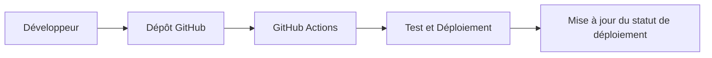

# Github Plan

```mermaid
graph LR
    A[Développeur] --> B[Dépôt GitHub]
    B --> C[GitHub Actions]
    C --> D[Test et Déploiement]
    D --> E[Mise à jour du statut de déploiement]
```

# GitLab Plan

# Jenkins Plan

# Travis Plan