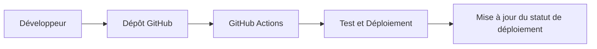
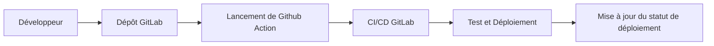
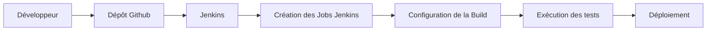
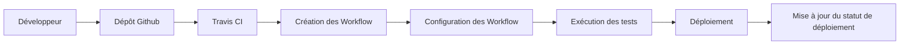

# Plan Projet

## Github Plan

## GitLab Plan

## Jenkins Plan

## Travis Plan

# Répartition du travail

Macéo est en charge de la mise en place d'un environnement de CI/CD avec runners sur GitLab

Philippe est en charge de la mise en place de Jenkins et de la création des jobs.

Thomas est en charge de la mise en place et la création des Jobs sur Travis CI.

Anthony est en charge de GitHub et le mise en commun avec les autres technologie de CI/CD